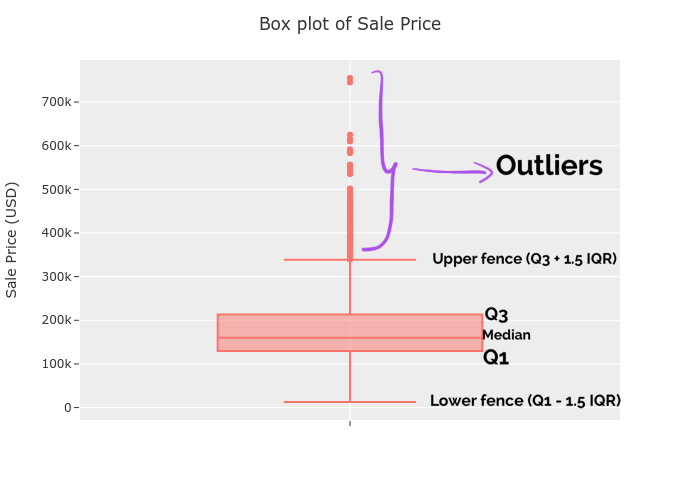

Exploratory Data Analysis (EDA) is the first step in understanding your data. We will look at EDA for numerical and categorical data in a series of posts. In this post, we will look at two the most common graphs / plots for numerical data using the Ames housing data in Python.

The dataset is a list of houses with their attributes and prices from the city Ames, Iowa, USA. The original data was compiled by [Dean De Cock](http://jse.amstat.org/v19n3/decock.pdf).This particular version of the data is from the
[AmesHousing](https://cran.r-project.org/web/packages/AmesHousing/index.html)
 R package. It has been cleaned and enhanced, and hence fit for our purpose of this post - to demo Exploratory Data Visualization.

```python
import numpy as np
import pandas as pd

# plotting
import plotly.express as px
import plotly.graph_objects as go
import plotly.io as pio

from pathlib import Path

# Plotly options
pio.templates.default = "ggplot2"
pio.renderers.default = "notebook_connected"
```

```python
# path to the dat file
p = Path('..')
p = p / 'data'
data_file = p / 'raw' / 'ames.csv'

# load the data
df = pd.read_csv(data_file)
df.head(10)
```

<div>
<style scoped>
    .dataframe tbody tr th:only-of-type {
        vertical-align: middle;
    }

    .dataframe tbody tr th {
        vertical-align: top;
    }

    .dataframe thead th {
        text-align: right;
    }
</style>
<table border="1" class="dataframe">
  <thead>
    <tr style="text-align: right;">
      <th></th>
      <th>MS_SubClass</th>
      <th>MS_Zoning</th>
      <th>Lot_Frontage</th>
      <th>Lot_Area</th>
      <th>Street</th>
      <th>Alley</th>
      <th>Lot_Shape</th>
      <th>Land_Contour</th>
      <th>Utilities</th>
      <th>Lot_Config</th>
      <th>...</th>
      <th>Fence</th>
      <th>Misc_Feature</th>
      <th>Misc_Val</th>
      <th>Mo_Sold</th>
      <th>Year_Sold</th>
      <th>Sale_Type</th>
      <th>Sale_Condition</th>
      <th>Sale_Price</th>
      <th>Longitude</th>
      <th>Latitude</th>
    </tr>
  </thead>
  <tbody>
    <tr>
      <th>0</th>
      <td>One_Story_1946_and_Newer_All_Styles</td>
      <td>Residential_Low_Density</td>
      <td>141</td>
      <td>31770</td>
      <td>Pave</td>
      <td>No_Alley_Access</td>
      <td>Slightly_Irregular</td>
      <td>Lvl</td>
      <td>AllPub</td>
      <td>Corner</td>
      <td>...</td>
      <td>No_Fence</td>
      <td>None</td>
      <td>0</td>
      <td>5</td>
      <td>2010</td>
      <td>WD</td>
      <td>Normal</td>
      <td>215000</td>
      <td>-93.619754</td>
      <td>42.054035</td>
    </tr>
    <tr>
      <th>1</th>
      <td>One_Story_1946_and_Newer_All_Styles</td>
      <td>Residential_High_Density</td>
      <td>80</td>
      <td>11622</td>
      <td>Pave</td>
      <td>No_Alley_Access</td>
      <td>Regular</td>
      <td>Lvl</td>
      <td>AllPub</td>
      <td>Inside</td>
      <td>...</td>
      <td>Minimum_Privacy</td>
      <td>None</td>
      <td>0</td>
      <td>6</td>
      <td>2010</td>
      <td>WD</td>
      <td>Normal</td>
      <td>105000</td>
      <td>-93.619756</td>
      <td>42.053014</td>
    </tr>
    <tr>
      <th>2</th>
      <td>One_Story_1946_and_Newer_All_Styles</td>
      <td>Residential_Low_Density</td>
      <td>81</td>
      <td>14267</td>
      <td>Pave</td>
      <td>No_Alley_Access</td>
      <td>Slightly_Irregular</td>
      <td>Lvl</td>
      <td>AllPub</td>
      <td>Corner</td>
      <td>...</td>
      <td>No_Fence</td>
      <td>Gar2</td>
      <td>12500</td>
      <td>6</td>
      <td>2010</td>
      <td>WD</td>
      <td>Normal</td>
      <td>172000</td>
      <td>-93.619387</td>
      <td>42.052659</td>
    </tr>
    <tr>
      <th>3</th>
      <td>One_Story_1946_and_Newer_All_Styles</td>
      <td>Residential_Low_Density</td>
      <td>93</td>
      <td>11160</td>
      <td>Pave</td>
      <td>No_Alley_Access</td>
      <td>Regular</td>
      <td>Lvl</td>
      <td>AllPub</td>
      <td>Corner</td>
      <td>...</td>
      <td>No_Fence</td>
      <td>None</td>
      <td>0</td>
      <td>4</td>
      <td>2010</td>
      <td>WD</td>
      <td>Normal</td>
      <td>244000</td>
      <td>-93.617320</td>
      <td>42.051245</td>
    </tr>
    <tr>
      <th>4</th>
      <td>Two_Story_1946_and_Newer</td>
      <td>Residential_Low_Density</td>
      <td>74</td>
      <td>13830</td>
      <td>Pave</td>
      <td>No_Alley_Access</td>
      <td>Slightly_Irregular</td>
      <td>Lvl</td>
      <td>AllPub</td>
      <td>Inside</td>
      <td>...</td>
      <td>Minimum_Privacy</td>
      <td>None</td>
      <td>0</td>
      <td>3</td>
      <td>2010</td>
      <td>WD</td>
      <td>Normal</td>
      <td>189900</td>
      <td>-93.638933</td>
      <td>42.060899</td>
    </tr>
    <tr>
      <th>5</th>
      <td>Two_Story_1946_and_Newer</td>
      <td>Residential_Low_Density</td>
      <td>78</td>
      <td>9978</td>
      <td>Pave</td>
      <td>No_Alley_Access</td>
      <td>Slightly_Irregular</td>
      <td>Lvl</td>
      <td>AllPub</td>
      <td>Inside</td>
      <td>...</td>
      <td>No_Fence</td>
      <td>None</td>
      <td>0</td>
      <td>6</td>
      <td>2010</td>
      <td>WD</td>
      <td>Normal</td>
      <td>195500</td>
      <td>-93.638925</td>
      <td>42.060779</td>
    </tr>
    <tr>
      <th>6</th>
      <td>One_Story_PUD_1946_and_Newer</td>
      <td>Residential_Low_Density</td>
      <td>41</td>
      <td>4920</td>
      <td>Pave</td>
      <td>No_Alley_Access</td>
      <td>Regular</td>
      <td>Lvl</td>
      <td>AllPub</td>
      <td>Inside</td>
      <td>...</td>
      <td>No_Fence</td>
      <td>None</td>
      <td>0</td>
      <td>4</td>
      <td>2010</td>
      <td>WD</td>
      <td>Normal</td>
      <td>213500</td>
      <td>-93.633792</td>
      <td>42.062978</td>
    </tr>
    <tr>
      <th>7</th>
      <td>One_Story_PUD_1946_and_Newer</td>
      <td>Residential_Low_Density</td>
      <td>43</td>
      <td>5005</td>
      <td>Pave</td>
      <td>No_Alley_Access</td>
      <td>Slightly_Irregular</td>
      <td>HLS</td>
      <td>AllPub</td>
      <td>Inside</td>
      <td>...</td>
      <td>No_Fence</td>
      <td>None</td>
      <td>0</td>
      <td>1</td>
      <td>2010</td>
      <td>WD</td>
      <td>Normal</td>
      <td>191500</td>
      <td>-93.633826</td>
      <td>42.060728</td>
    </tr>
    <tr>
      <th>8</th>
      <td>One_Story_PUD_1946_and_Newer</td>
      <td>Residential_Low_Density</td>
      <td>39</td>
      <td>5389</td>
      <td>Pave</td>
      <td>No_Alley_Access</td>
      <td>Slightly_Irregular</td>
      <td>Lvl</td>
      <td>AllPub</td>
      <td>Inside</td>
      <td>...</td>
      <td>No_Fence</td>
      <td>None</td>
      <td>0</td>
      <td>3</td>
      <td>2010</td>
      <td>WD</td>
      <td>Normal</td>
      <td>236500</td>
      <td>-93.632852</td>
      <td>42.061120</td>
    </tr>
    <tr>
      <th>9</th>
      <td>Two_Story_1946_and_Newer</td>
      <td>Residential_Low_Density</td>
      <td>60</td>
      <td>7500</td>
      <td>Pave</td>
      <td>No_Alley_Access</td>
      <td>Regular</td>
      <td>Lvl</td>
      <td>AllPub</td>
      <td>Inside</td>
      <td>...</td>
      <td>No_Fence</td>
      <td>None</td>
      <td>0</td>
      <td>6</td>
      <td>2010</td>
      <td>WD</td>
      <td>Normal</td>
      <td>189000</td>
      <td>-93.639068</td>
      <td>42.059193</td>
    </tr>
  </tbody>
</table>
<p>10 rows × 81 columns</p>
</div>

```python
print(f"Dataframe Shape: {df.shape}")
print(f"Column List: {df.columns}")
```

    Dataframe Shape: (2930, 81)
    Column List: Index(['MS_SubClass', 'MS_Zoning', 'Lot_Frontage', 'Lot_Area', 'Street',
           'Alley', 'Lot_Shape', 'Land_Contour', 'Utilities', 'Lot_Config',
           'Land_Slope', 'Neighborhood', 'Condition_1', 'Condition_2', 'Bldg_Type',
           'House_Style', 'Overall_Qual', 'Overall_Cond', 'Year_Built',
           'Year_Remod_Add', 'Roof_Style', 'Roof_Matl', 'Exterior_1st',
           'Exterior_2nd', 'Mas_Vnr_Type', 'Mas_Vnr_Area', 'Exter_Qual',
           'Exter_Cond', 'Foundation', 'Bsmt_Qual', 'Bsmt_Cond', 'Bsmt_Exposure',
           'BsmtFin_Type_1', 'BsmtFin_SF_1', 'BsmtFin_Type_2', 'BsmtFin_SF_2',
           'Bsmt_Unf_SF', 'Total_Bsmt_SF', 'Heating', 'Heating_QC', 'Central_Air',
           'Electrical', 'First_Flr_SF', 'Second_Flr_SF', 'Low_Qual_Fin_SF',
           'Gr_Liv_Area', 'Bsmt_Full_Bath', 'Bsmt_Half_Bath', 'Full_Bath',
           'Half_Bath', 'Bedroom_AbvGr', 'Kitchen_AbvGr', 'Kitchen_Qual',
           'TotRms_AbvGrd', 'Functional', 'Fireplaces', 'Fireplace_Qu',
           'Garage_Type', 'Garage_Finish', 'Garage_Cars', 'Garage_Area',
           'Garage_Qual', 'Garage_Cond', 'Paved_Drive', 'Wood_Deck_SF',
           'Open_Porch_SF', 'Enclosed_Porch', 'Three_season_porch', 'Screen_Porch',
           'Pool_Area', 'Pool_QC', 'Fence', 'Misc_Feature', 'Misc_Val', 'Mo_Sold',
           'Year_Sold', 'Sale_Type', 'Sale_Condition', 'Sale_Price', 'Longitude',
           'Latitude'],
          dtype='object')


For our prediction model, the response variable _(the y variable)_ is `Sale Price` and the predictor variables _(about 80 of them)_ are attributes of the houses and their neighborhood.

```python
# hide
def export_figures_as_html(num_figures):
    """Hack to export all plotly figures as HTML pages"""
    for num in range(1, num_figures + 1):
        try:
            eval("fig" + str(num)).write_html('fig' + str(num) + '.html', include_plotlyjs='cdn')
        except:
            continue


```

## Visualizing the distribution using the Histogram

For numerical variables we are interested in knowing the distribution:

- the range of the values, 
- the center of the distribution, 
- the spread of the distribution (normal, or skewed) ,
- the most frequent values

A histogram helps us to view these details. Let us look a few examples of it.

### Histogram of the Sale Price

```python
fig1 = px.histogram(df, x='Sale_Price')
fig1.show()
```

<iframe src="fig1.html" width=95% height=600px style="border:none;"></iframe>

In a histogram , the height of each bar reflects the number of times _(frequency)_ of the prices which fall in the corresponding interval. For example, in the above histogram there are 81 values in the price interval 81,000 - 89,999 USD. 

The histogram is right skewed - there is a long right tail. Most of the houses are priced from 50,000 to 400,000 USD - while there are houses above that range but they are very few of them and they are spread thinly up to the 800,000 USD.

#### Improving the histogram

- bin widths
- borders for bins
- using percentages or proportions for y-axis

Please experiment with different settings for the above and observe if you can find any new insights to the data. 

Also, for all plots it is a good practice to have a plot title and that the axes have meaningful labels. For example, for our histogram we could change the x-axis label to indicate that the `Sale Price` is in USD.

Below is the histogram for the `Sale Price` with a bin width of 20,000 and normalized to use percentages on the y-axis. Also we have improved the labeling of the x-axis and added a title to the plot as well.

```python
fig2 = px.histogram(df, x='Sale_Price', nbins=50, 
                    histnorm='percent'
                   )

fig2.update_layout(
    title_text='Distribution of Housing Prices', # title of plot
    xaxis_title_text='Sale Price (USD)', # xaxis label
    yaxis_title_text='Percent', # yaxis label
)

fig2.show()

```

<iframe src="fig2.html" width=95% height=600px style="border:none;"></iframe>

## The Box plot 

Another way to understand numerical variables is to have numeric descriptions that summarize them. The five-number summary does just that - it gives us an idea of shape of the numeric variable:
    - the minimum,
    - first quartile,
    - the median,
    - third quartile and
    - the maximum

The Box plot is a graph that allows us to view the five-number summary. Let us view the box-plot for the `Sale Price` variable.

```python
fig3 = px.box(df, y='Sale_Price')
fig3.update_layout(
    title_text='Box plot of Sale Price', 
    yaxis_title_text='Sale Price (USD)',
)
fig3.show()

```

<iframe src="fig3.html" width=95% height=600px style="border:none;"></iframe>

### Understanding the Box plot



To understand how a box plot is constructed, we first need to understand what are  quartiles and the Interquartile Range (IQR).  Consider a set of 11 numbers - $0, 1, 2, 3, 4, 5, 6, 7, 8, 9, 10, 11$. Now let us calculate the median, first and third quartiles and the IQR.

- **Median** : the median is the mid point of a set of sorted numbers - in this case, we have  11 numbers and the middle one is 5.
- **First Quartile (Q1)** : The first quartile is the median of the numbers below the original median - the lower half of numbers.. In our case the numbers are - $0, 1, 2, 3, 4, 5$ and the median of those numbers is 2.5 ($ \frac{2 + 3}{2} $).
- **Third Quartile (Q3)** : Similarly the third quartile - the median of the upper half can be calculated as 7.5
- **IQR** : The IQR is the difference between the third and the first quartiles ($7.5 - 2.5$) = 5.

We have used what is known as the `inclusive algorithm` for calculating the quartiles. There are other ways to calculate them - please refer to [https://en.wikipedia.org/wiki/Quartile](https://en.wikipedia.org/wiki/Quartile) for more details.

Returning to the box plot, the median, Q1 and Q3 are plotted with the `box`. The lower fence is then plotted at the first number in our sample that is greater than or equal to $Q1 - 1.5 * IQR$. The upper fence is plotted at the first number is the sample that is less than or equal to $Q3 + 1.5 * IQR$. Any observations that fall outside the upper and lower fence are considered as outliers and separate points are plotted to indicate them.

## Numerical Summaries

Of course, EDA need not be all graphs. One simple summary that can be used in conjunction with histograms and box plots is the mean - which tells the center of the sample and, the standard deviation which quantifies how spread the distribution is. Let us see how to get them in Pandas and in R 

### pandas `describe`

```python
df.Sale_Price.describe()
```

```
    count      2930.000000
    mean     180796.060068
    std       79886.692357
    min       12789.000000
    25%      129500.000000
    50%      160000.000000
    75%      213500.000000
    max      755000.000000
    Name: Sale_Price, dtype: float64
```

### R's `summary` 

R's `summary` function provides the five-number summary but does not display the standard deviation like pandas's `describe` does.

```R
# mean,median,25th and 75th quartiles,min,max
summary(df$Sale_Price)
```

```
   Min. 1st Qu.  Median    Mean 3rd Qu.    Max. 
  12789  129500  160000  180796  213500  755000 
```

In the following posts, let us look at more EDA methods for numerical and categorical variables and for exploring relationships between them.