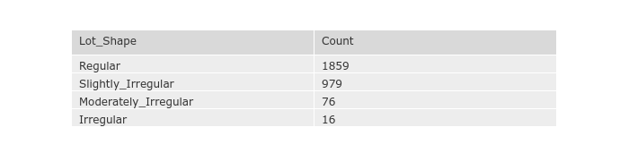
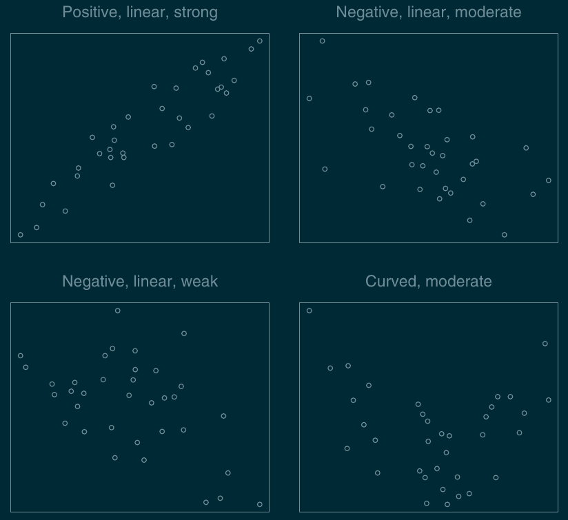

In the [previous post](../exploratory_analysis), we looked at two plots for understanding numeric data. Now we will look at bar charts and contingency tables for single and multiple variables. Then we look at plots for relationships between various data - scatter plots and line plots. Finally, we look at facets that help us view multiple related plots simultaneously.

## Visualizing the groups in a categorical variable using Bar charts

For a categorical variable, we are interested in viewing the groups within it. A bar plot provides an easy way to visualize the group and their counts.

### Bar chart of the Lot Shape variable


```python
# we supply the counts via a temporary data frame to plotly
df_count = df['Lot_Shape'].value_counts()
df_count = pd.DataFrame(df_count).reset_index()
df_count.columns = ['Lot_Shape','Count']

fig1 = px.bar(df_count, x='Lot_Shape', y='Count')
fig1.show()
```

<iframe src="fig1.html" width=95% height=600px style="border:none;"></iframe>


## Using tables to view the distribution of categorical variables

A simple table to display the counts is also useful to view the distribution of a categorical table. 


```python
fig2 = go.Figure(data=[go.Table(
    header=dict(values=list(df_count.columns),
                #fill_color='paleturquoise',
                align='left'),
    cells=dict(values=[df_count.Lot_Shape, df_count.Count],               
               align='left'))
])
fig2.show()

```



To view the joint frequency distribution of two variables, we can use a [contingency table](https://en.wikipedia.org/wiki/Contingency_table). It is quite easy to generate one in pandas using the `crosstab` function.

```python
# contingency table for Lot Shape vs Building Type
df_cross = pd.crosstab(df.Lot_Shape, df.Bldg_Type, margins=True, margins_name="Total")
df_cross
```

<div>
<style scoped>
    .dataframe tbody tr th:only-of-type {
        vertical-align: middle;
    }

    .dataframe tbody tr th {
        vertical-align: top;
    }

    .dataframe thead th {
        text-align: right;
    }
</style>
<table border="1" class="dataframe">
  <thead>
    <tr style="text-align: right;">
      <th>Bldg_Type</th>
      <th>Duplex</th>
      <th>OneFam</th>
      <th>Twnhs</th>
      <th>TwnhsE</th>
      <th>TwoFmCon</th>
      <th>Total</th>
    </tr>
    <tr>
      <th>Lot_Shape</th>
      <th></th>
      <th></th>
      <th></th>
      <th></th>
      <th></th>
      <th></th>
    </tr>
  </thead>
  <tbody>
    <tr>
      <th>Irregular</th>
      <td>0</td>
      <td>14</td>
      <td>0</td>
      <td>1</td>
      <td>1</td>
      <td>16</td>
    </tr>
    <tr>
      <th>Moderately_Irregular</th>
      <td>1</td>
      <td>67</td>
      <td>0</td>
      <td>8</td>
      <td>0</td>
      <td>76</td>
    </tr>
    <tr>
      <th>Regular</th>
      <td>84</td>
      <td>1487</td>
      <td>93</td>
      <td>141</td>
      <td>54</td>
      <td>1859</td>
    </tr>
    <tr>
      <th>Slightly_Irregular</th>
      <td>24</td>
      <td>857</td>
      <td>8</td>
      <td>83</td>
      <td>7</td>
      <td>979</td>
    </tr>
    <tr>
      <th>Total</th>
      <td>109</td>
      <td>2425</td>
      <td>101</td>
      <td>233</td>
      <td>62</td>
      <td>2930</td>
    </tr>
  </tbody>
</table>
</div>


## Scatter plots


Scatter plots let us view the relationship between two numeric variables. The relationship between two numeric variables can be described in terms of **direction** ( _positive or negative_ ), **form** ( _linear, non-linear, or curved_ ) and **strength** ( _strong, moderate, or weak_ ). 




Let us see a scatter plot of `Living Room Area` vs `Sale Price`. 


```python
fig3 = px.scatter(df, x="Gr_Liv_Area", y="Sale_Price")
fig3.update_layout(
    title_text='Living Area vs Sale Price', # title of plot
    yaxis_title_text='Sale Price (USD)', # yaxis label
    xaxis_title_text='Living Room Area (sq ft.)', # xaxis label
)
fig3.show()
```
<iframe src="fig3.html" width=95% height=600px style="border:none;"></iframe>


From the above scatter plot, it is easy to see that there is a positive, linear and strong relationship between `Living Area` and `Sale Price`. They are positively correlated.  This measure of the relationship is called **correlation**, which gives us an idea of the strength of the relationship. Refer to the [Pearson correlation coefficient](https://en.wikipedia.org/wiki/Pearson_correlation_coefficient) and [Spearman's rank correlation coefficient](https://en.wikipedia.org/wiki/Spearman%27s_rank_correlation_coefficient) for more details.

## Line Plots

Line plots are useful to visualize trends over time. For this example, let us use the life expectancy data from [Gapminder](https://www.gapminder.org/data/). The plot displays the life expectancy over the years for India.


```python
df = px.data.gapminder().query("country=='India'")
fig4 = px.line(df, x="year", y="lifeExp",)
fig4.update_layout(
    title_text='Average Life Expectancy for India', # title of plot
    yaxis_title_text='Life Expectancy (years)', # yaxis label
    xaxis_title_text='Year', # xaxis label
)
fig4.show()
```

<iframe src="fig4.html" width=95% height=600px style="border:none;"></iframe>

We can also use line charts to compare the values for two or more categorical variables over a time series. For instance, we can compare the life expectancy for India, Iceland, and Japan in a single chart by coloring the country's lines.

```python
df = px.data.gapminder().query("country in ['India', 'Iceland', 'Japan']")
fig5 = px.line(df, x="year", y="lifeExp", color='country')
fig5.update_layout(
    title_text='Average Life Expectancy Compared', # title of plot
    yaxis_title_text='Life Expectancy (years)', # yaxis label
    xaxis_title_text='Year', # xaxis label
)
fig5.show()
```

<iframe src="fig5.html" width=95% height=600px style="border:none;"></iframe>


## Faceting

Faceting is a way of visualizing subsets of data in a single plot. For example, if we want to compare the life expectancy of all countries grouped by `Continent`, a single line plot will soon become messy. We can easily `facet` the plot by `Continent` as shown below:


```python
df = px.data.gapminder()
fig6 = px.line(df, x="year", y="lifeExp",
               color="country", 
               hover_name="country", 
               facet_col="continent", 
               facet_col_wrap=1,
          )
fig6.update_layout(
    title_text='Average Life Expectancy Compared', # title of plot
    xaxis_title_text='Year', # xaxis label
)
fig6.show()
```

<iframe src="fig6.html" width=95% height=600px style="border:none;"></iframe>


While the above plot did what we expected, it has lots of 'visual noise'. Avoid using these kinds of plots when presenting it to your client or the management.

Let us see a neater example of faceting. Let us plot a scatter plot of `GDP` vs. `Life Expectancy` faceted by `Year`. Also note that we have added more information to the plots by sizing the scatter points by `Population` and coloring them by `Continent`.


```python
fig7 = px.scatter(df, x='gdpPercap', y='lifeExp', color='continent', size='pop',
                facet_col='year', facet_col_wrap=4)
fig7.update_layout(
    title_text='GDP vs Life Expectancy Compared', # title of plot
    xaxis_title_text='GDP', # xaxis label
    yaxis_title_text = 'Life Expectancy'
)
fig7.show()
```

<iframe src="fig7.html" width=95% height=600px style="border:none;"></iframe>

This post concludes the introduction to EDA. We have barely scratched the surface of exploratory data analysis in this and the previous posts. For more resources, please refer to the documentation of [Seaborn](https://seaborn.pydata.org/examples/index.html) and [ggplot2](https://ggplot2.tidyverse.org/reference/index.html). Wikipedia has an  excellent section on [EDA](https://en.wikipedia.org/wiki/Exploratory_data_analysis). I also like this [resource](https://itl.nist.gov/div898/handbook/index.htm) from the National Institute of Standards and Technology's Engineering Statistics Handbook.

Happy exploring !!
